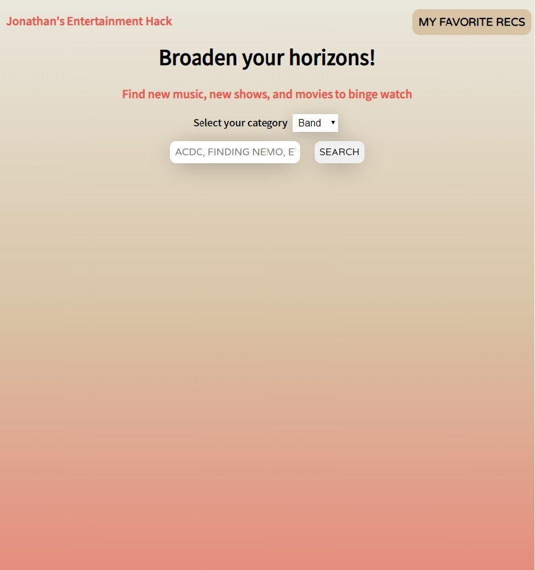
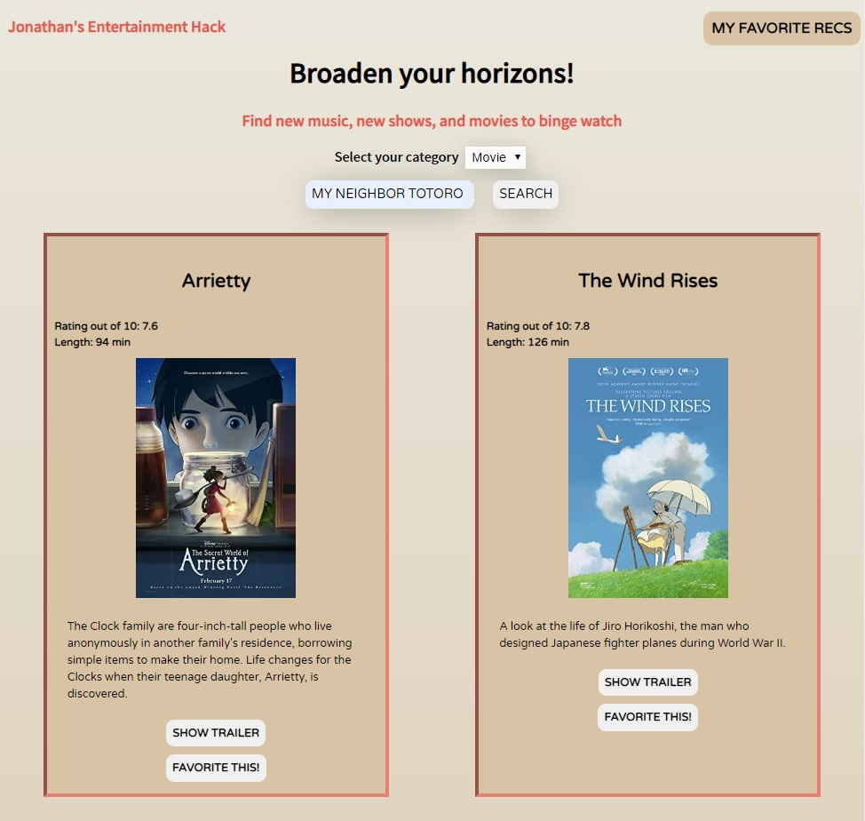
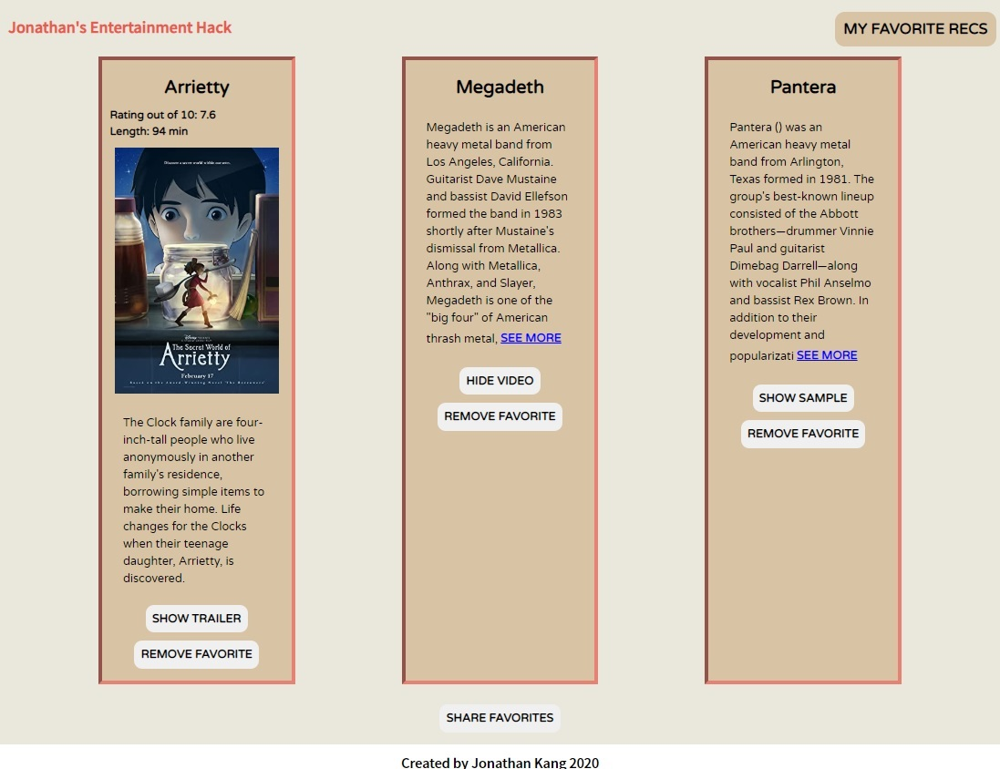

# API Project

An entertainment recommendation application.  Users can create lists of 

## Skills

This application showcases my knowledge of fetch requests, ajax requests, and jQuery functions to provide a streamlined website.

## Build Status

https://jonmkang.github.io/api-hack-project/

## Screenshots
Start of the search screen:

Results:

Favorites:

## Features
* Search an artist or movie you like
* See list of recommendations based off search
* Add recommended results to Favorites
* Copies list of favorites to clipboard
